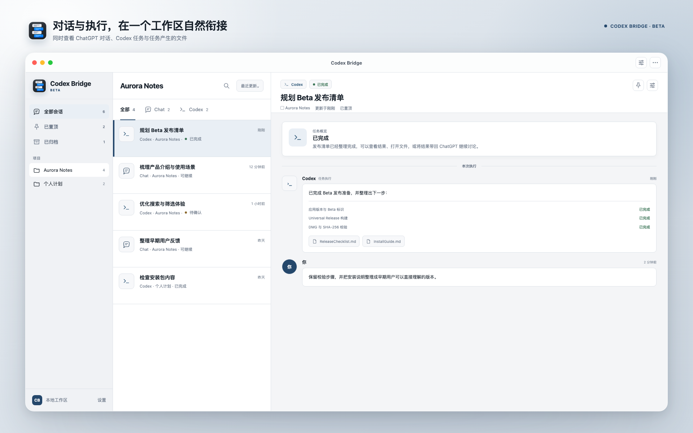
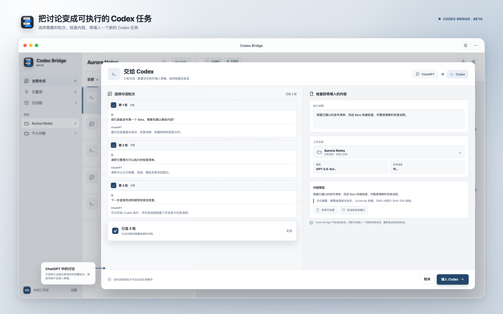
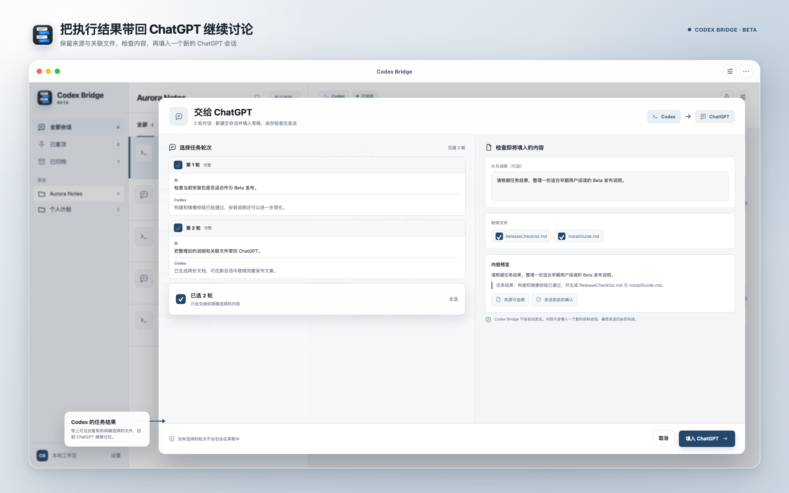

# Codex Bridge

在 ChatGPT 的讨论与 Codex 的执行之间，完成清晰、可确认的上下文交接。

[](https://github.com/lijingpeng/codexbridge/releases)


[](LICENSE)

[发布下载（Windows / macOS）](https://github.com/lijingpeng/codexbridge/releases) · [更新记录](CHANGELOG.md) · [报告问题](https://github.com/lijingpeng/codexbridge/issues)



Codex Bridge 是 ChatGPT ↔ Codex 的本地上下文桥接工具，提供 Windows 和 macOS 实现，两者功能边界不同。以下先介绍 Windows v1.0.0；后面的 macOS 部分保留原有 Beta 使用说明，上图为 macOS 界面。

## Windows v1.0.0

Windows 版是 ChatGPT ↔ Codex 的本地上下文桥接工具：ChatGPT 负责提供捕获的上下文，Codex 集成只做发现和读取，Context / Draft / Handoff 由用户确认后再使用。Windows 版不会自动发送或执行 Codex 内容。

### Windows Requirements

- Windows 10 或 Windows 11，x64。
- 可用的 Codex executable（Codex Desktop 附带或 Codex CLI，需支持 app-server；用于只读会话发现和读取）。
- 可选 Git executable（用于只读 Git 状态和差异）。
- ChatGPT Web、Google Chrome 或 Microsoft Edge。
- Chrome / Edge 扩展的“加载已解压的扩展程序”权限。
- 官方 Windows x64 发布包为 self-contained，不要求另外安装 .NET Desktop Runtime。

### Windows Quick Start

1. 解压 `CodexBridge-win-x64-v1.0.0.zip`。
2. 在解压目录打开 PowerShell，注册 Native Messaging Host：

   ```powershell
   .\scripts\install-native-host-windows.ps1 `
     -NativeHostPath .\NativeHost\CodexBridge.NativeHost.exe `
     -ManifestTemplatePath .\NativeHost\app.codexbridge.nativehost.json
   ```

3. 在 Chrome 或 Edge 的扩展管理页开启开发者模式，加载 `Extension` 文件夹。
4. 启动 `App\CodexBridge.App.exe`，选择或添加工作区。
5. 如果 Codex executable 未自动发现，可在启动前设置通用路径覆盖：

   ```powershell
   $env:CODEX_BRIDGE_CODEX_PATH="C:\Path\To\codex.exe"
   ```

6. 在 ChatGPT Web 中通过扩展捕获对话，回到 Codex Bridge 选择会话轮次。
7. 构建 Context / Draft，检查预览，并由你确认后继续使用。

注册仅写当前用户的 Chrome / Edge Native Messaging 注册及生成的 manifest；NativeHost 不会被复制到其它目录，请保留解压目录。扩展版本仍为独立的 `1.1.1`，固定 ID 为 `pnpgopcjhgfmnkefmdnoebmcbnnhnhee`。可在注册命令后加 `-WhatIf` 只检查路径、不写入；不要为测试覆盖已有正式注册。Windows ZIP 未代码签名，遇到组织安全策略限制时请联系管理员，不要绕过安全限制。

### Windows 工作现场

工作现场支持手动保存、Quick Save、工作区切换前可选自动保存、自动去重、自动保留数量、Restore Preview、Restore、ZIP Export / Import 和 Exit Protection。

Quick Save 和退出前确认保存属于手动现场，不受自动现场 retention 清理影响；自动现场重命名后也转为手动现场。没有定时后台保存。ZIP 导入允许保留其它工作区的现场，但不改写其归属，也不会自动 Restore。

Restore 只恢复当前会话中可匹配的选中轮次、Context 和 Handoff；不会修改工作区项目文件、Git branch、Git HEAD、Git working tree、ChatGPT / Codex 会话正文或 Clipboard。工作区归属不匹配时，Restore 会被阻止并要求用户回到对应工作区。

Windows 发布包的 SHA256 校验文件与 ZIP 放在同一目录，可用以下命令校验：

```powershell
Get-FileHash .\CodexBridge-win-x64-v1.0.0.zip -Algorithm SHA256
Get-Content .\CodexBridge-win-x64-v1.0.0.zip.sha256
```

### Windows 从源码构建与打包

需要 .NET 8 SDK。首次构建先运行 `dotnet restore apps/windows/CodexBridge.Windows.sln`，然后：

```powershell
dotnet build apps/windows/CodexBridge.Windows.sln -c Release --no-restore
dotnet run --project apps/windows/CodexBridge.Core.Tests -c Release --no-build
dotnet run --project apps/windows/CodexBridge.App.Tests -c Release --no-build
.\scripts\windows\publish-release.ps1
```

版本统一来自 `Directory.Build.props`。脚本仅 publish App 与 NativeHost 为 self-contained `win-x64`，首次需要可用 NuGet 源下载 runtime packs。ZIP 与 `.sha256` 输出到忽略的 `artifacts/release/`；已存在的包不会覆盖，可使用 `-OutputRoot artifacts/release/rebuild` 输出新一份。

## macOS Beta 使用说明

以下主要功能、安装、权限、自动更新和填入草稿说明针对 macOS，不代表 Windows 版具有自动创建任务或 App 内更新能力。

## 主要功能

- 在一个工作区中查看 ChatGPT 对话、Codex 任务及任务产生的文件
- 按项目浏览 Codex 会话，并支持搜索、筛选、置顶和本地归档
- 按完整轮次选择需要交接的上下文，避免遗漏问题或回复
- 从 ChatGPT 新建 Codex 任务并填入草稿，可选择工作目录、模型与思考强度
- 从 Codex 新建 ChatGPT 会话并填入草稿，可附带选中的文本文件
- 支持 ChatGPT App，以及通过 Chrome 或 Microsoft Edge 扩展保存的 ChatGPT 网页对话
- 自动同步 Codex 会话变化，并可在 App 内检查、下载和安装 GitHub Releases 中的新版本
- 所有交接均可预览；Codex Bridge 不会自动点击发送

## ChatGPT → Codex

选择 ChatGPT 中已经讨论清楚的轮次，补充执行说明和工作目录，再将内容填入一个新的 Codex 任务。



## Codex → ChatGPT

选择 Codex 的任务轮次和相关文本文件，将执行结果填入一个新的 ChatGPT 会话，继续整理、解释或讨论。



## 系统要求

- macOS 14 Sonoma 或更高版本
- Apple Silicon 或 Intel Mac
- 使用 Codex 交接功能时，需要安装并能够正常使用包含 Codex 的 ChatGPT macOS App
- 从 ChatGPT App 保存对话时，需要授予 Codex Bridge 辅助功能权限
- 从 ChatGPT 网页保存对话时，需要 Chrome 或 Microsoft Edge，并手动加载随 App 提供的扩展

## 安装

1. 打开 [GitHub Releases](https://github.com/lijingpeng/codexbridge/releases)，下载最新的 `Codex-Bridge-*.dmg`。
2. 打开 DMG，将 **Codex Bridge** 拖入“应用程序”。
3. 从“应用程序”打开 Codex Bridge。
4. 如果 macOS 阻止首次运行，请先尝试打开一次，然后前往“系统设置 → 隐私与安全性”，找到 Codex Bridge 并点击“仍要打开”。

当前 Beta 使用临时签名，尚未经过 Apple notarization。请只从本仓库的 Releases 页面下载安装包；不需要关闭 Gatekeeper 或修改系统的全局安全策略。

### 校验下载文件

每个 Release 同时提供 `.sha256` 文件。将 DMG 与校验文件放在同一目录后执行：

```bash
shasum -a 256 -c Codex-Bridge-1.1.1-beta.3-universal.dmg.sha256
```

输出包含 `OK` 表示文件与发布时生成的校验值一致。

## 开始使用

### 连接 ChatGPT App

1. 打开 Codex Bridge 设置中的“来源与权限”。
2. 在“ChatGPT App”中点击授权辅助功能。
3. 按系统提示允许 Codex Bridge，然后回到 App 重新检查。
4. 在 ChatGPT App 中打开一段对话，使用 Codex Bridge 保存当前打开的内容。

Codex Bridge 只读取辅助功能接口中当前可见的 ChatGPT 窗口内容，不读取 ChatGPT 的私有数据库、Cookie 或 Token。

### 连接 ChatGPT 网页版

1. 打开 Codex Bridge 设置中的“来源与权限”。
2. 在“ChatGPT Web”中点击“准备连接”，选择 Chrome 或 Microsoft Edge。
3. 在浏览器扩展管理页开启“开发者模式”，点击“加载已解压的扩展程序”。
4. 使用 Codex Bridge 的“在访达中显示”找到扩展文件夹，或在文件选择窗口按 `Shift + Command + G` 后粘贴 App 提供的路径。
5. 打开 [chatgpt.com](https://chatgpt.com)，点击浏览器工具栏中的 Codex Bridge，选择需要的对话轮次并保存。

`Library`（资源库）文件夹在 macOS 中默认隐藏。你也可以在访达中按住 `Option` 打开“前往”菜单，再选择“资源库”。

升级 Codex Bridge 后，App 会自动更新已经准备好的扩展文件。Chrome 和 Edge 不会自动重新加载手动安装的扩展；看到更新提示时，请按提示打开扩展管理页，并在 Codex Bridge 扩展卡片中点击一次“重新加载”。

## 数据与隐私

- Codex Bridge 只处理你主动连接、导入或选择的内容
- 对话索引、置顶与归档状态保存在本机
- 在 Codex Bridge 中归档不会改动 ChatGPT 或 Codex 中的原会话
- 清除 Codex Bridge 本地数据不会删除 ChatGPT、Codex 会话或项目文件
- Codex Bridge 不保存 ChatGPT Cookie、Token 或账号密码
- App 每天最多访问一次 GitHub Releases 接口检查新版本，不会随请求上传对话内容
- 内容只会填入目标 App 的新草稿；是否发送始终由你决定
- 辅助功能权限可以随时在 macOS“系统设置 → 隐私与安全性 → 辅助功能”中撤销

在交接前，请检查预览中的对话和文件，避免发送密码、Token、个人信息或其他敏感内容。

## 从源码构建

需要 Xcode 26 或兼容 Swift 6 的新版 Xcode。

```bash
git clone https://github.com/lijingpeng/codexbridge.git
cd codexbridge
open apps/macos/CodexBridgeApp.xcodeproj
```

在 Xcode 中选择 `CodexBridge` scheme 后运行。也可以通过命令行构建和测试：

```bash
xcodebuild \
  -project apps/macos/CodexBridgeApp.xcodeproj \
  -scheme CodexBridge \
  -destination 'platform=macOS' \
  build

xcodebuild \
  -project apps/macos/CodexBridgeApp.xcodeproj \
  -scheme CodexBridge \
  -destination 'platform=macOS' \
  test
```

生成本地临时签名的 Universal DMG：

```bash
CODEX_BRIDGE_ALLOW_ADHOC=1 ./scripts/package-release.sh
```

产物会写入 `tmp/dist/`。临时签名仅适合本地测试和当前 Beta 分发；重新构建后，macOS 可能要求重新授予辅助功能权限。

## 常见问题

### 为什么 macOS 提示无法验证开发者？

当前 Beta 尚未 notarize。请确认安装包来自本仓库的 Releases 页面，尝试打开一次后，在“系统设置 → 隐私与安全性”中选择“仍要打开”。

### 已经授权辅助功能，为什么仍然无法读取？

退出 Codex Bridge，在系统辅助功能列表中移除旧条目，重新添加“应用程序”中的当前版本后再启动。临时签名版本重新构建或替换后，系统可能会把它视为新的 App。

### 浏览器扩展为什么显示不可用？

确保扩展已在 Chrome 或 Microsoft Edge 中启用，并至少在一个已打开的 `chatgpt.com` 页面中点击过 Codex Bridge 扩展。之后回到 App 的“来源与权限”重新检查。

### 浏览器扩展会自动更新吗？

Codex Bridge 会自动更新本机的扩展文件。由于扩展是通过“加载已解压的扩展程序”安装的，浏览器仍需要你在扩展管理页点击一次“重新加载”；App 检测到扩展版本变化后会给出提示和入口。

### Codex Bridge 会自动检查新版本吗？

会。App 启动后每天最多检查一次 GitHub Releases。你也可以在“设置 → 关于”中手动检查；下载和安装仍由你确认。

### Codex Bridge 会自动发送内容吗？

不会。它只新建目标任务或会话并填入草稿，最终发送由你完成。

### 本地归档会同步到 ChatGPT 或 Codex 吗？

不会。归档只影响 Codex Bridge 内的列表和项目视图，不会改动来源 App 中的原会话。

## Beta 说明

Codex Bridge 目前处于 Beta 阶段。ChatGPT、Codex、macOS 或浏览器更新后，连接和填入能力可能需要适配。遇到问题时，请在 [GitHub Issues](https://github.com/lijingpeng/codexbridge/issues) 中说明 macOS 版本、目标 App 或浏览器版本，以及可复现步骤；请勿附带私人对话、Token 或其他敏感信息。

## 免责声明

Codex Bridge 是独立开发的开源项目，与 OpenAI 无隶属、赞助或官方合作关系。ChatGPT、Codex、OpenAI 及相关标识归其各自权利人所有。

本项目目前处于 Beta 阶段，功能可能随着 macOS、ChatGPT、Codex 或浏览器更新而发生变化。Codex Bridge 只负责填入待确认的草稿，不会代替用户发送内容。用户应在发送前检查对话、文件及可能包含的敏感信息，并自行遵守相关产品和服务条款。

本软件依据 [Apache License 2.0](LICENSE) 提供，不附带任何明示或默示保证。完整条款以 `LICENSE` 为准。

## License

[Apache License 2.0](LICENSE)
